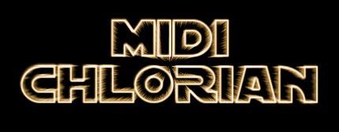

## Jason Kalili

<article float="left" class="col-6 col-12-xsmall work-item">

<h3>FitCheck, <strong>Product Manager/Full Stack Developer</strong></h3>
    
FitCheck is an app designed to cultivate, develop, and encourage the growth of fashion
        sense through community involvement. As a Product Manager and Full Stack Developer, my responsibilities include conducting weekly standup meetings, 
        sprint and workflow management, team assignments, as well as development and oversight of various application functions, which currently include 
        user authentication, state/user credential maintenance through Redux, camera/gallery upload, and database management and strategy.
        Our project uses ReactJS/React Native, React Redux, Expo, Node.js, and Google Firebase.
    

</article>

<article float="right" class="col-6 col-12-xsmall work-item">

<h3>Midi-Chlorian, <strong>Lead Designer</strong></h3>
    

        Midi-Chlorian is a programming language inspired by Star Wars and George Lucas.
        As Lead Designer, I built our programmatic grammar, interpretation methods, compilation
        tools, code generation and optimization. This project was built using Javascript, Node.js, 
        the Ohm Library, and MochaJS.
    

</article>
